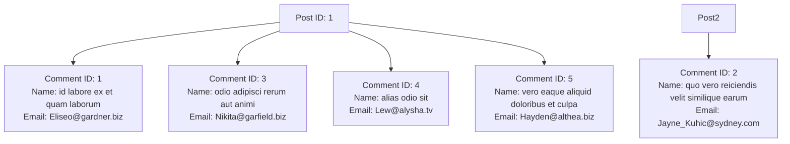

```mermaid
graph TD
    Post1["Post ID: 1"]
    Post1["Post ID: 1"]

    Comment1["Comment ID: 1<br/>Name: id labore ex et quam laborum<br/>Email: Eliseo@gardner.biz"]
    Comment2["Comment ID: 2<br/>Name: quo vero reiciendis velit similique earum<br/>Email: Jayne_Kuhic@sydney.com"]
    Comment3["Comment ID: 3<br/>Name: odio adipisci rerum aut animi<br/>Email: Nikita@garfield.biz"]
    Comment4["Comment ID: 4<br/>Name: alias odio sit<br/>Email: Lew@alysha.tv"]
    Comment5["Comment ID: 5<br/>Name: vero eaque aliquid doloribus et culpa<br/>Email: Hayden@althea.biz"]

    Post1 --> Comment1
    Post2 --> Comment2
    Post1 --> Comment3
    Post1 --> Comment4
    Post1 --> Comment5

```
